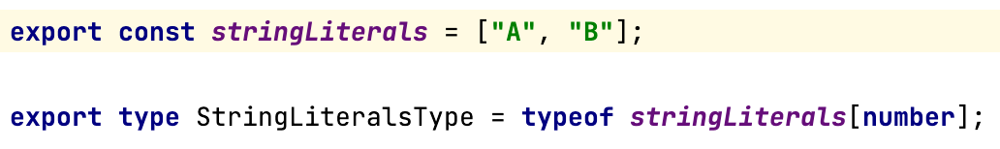
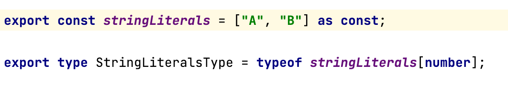
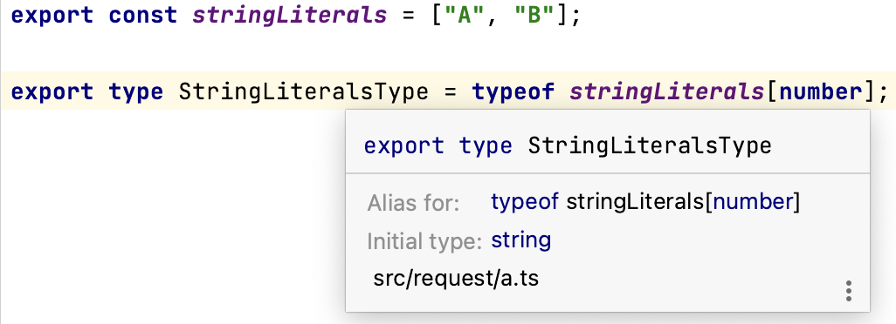
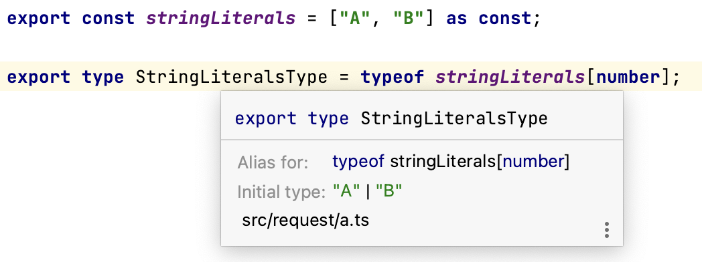

# Typescript

Something about typescript

## 2023-06-13

**Question**: What is the difference between the next two pieces of code?

**Answer**: TypesStringLiteralsType are different in these pieces. String array or union of literals.

